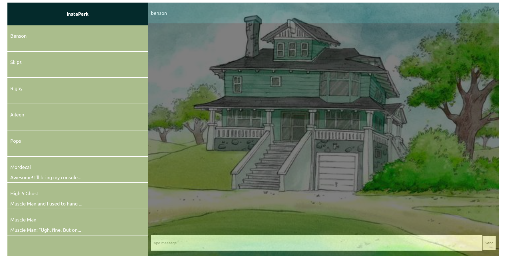
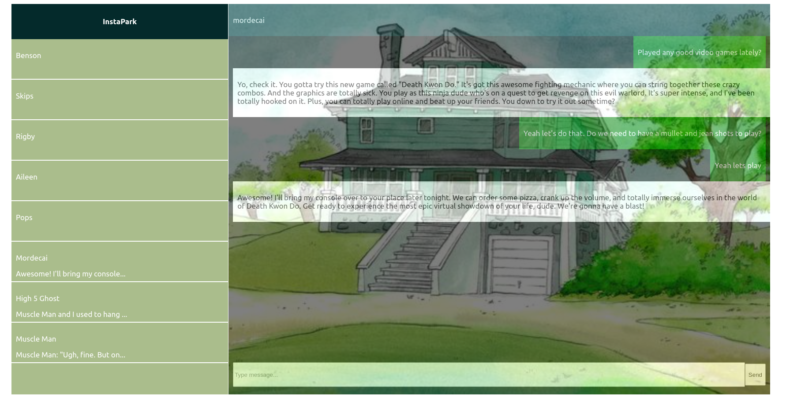

# Frontend

This forms the frontend of the app. It creates the UI that the user will be interacting with.

This is how the app looks when you open it. To start chating click on any of the names on the sidebar


This is how an ongoing chat looks like


To run the app enter the command

```bash
npm start
```

Make sure the backend is running before sending messages to the AI. Make sure to enter your own API Key at the backend as well.